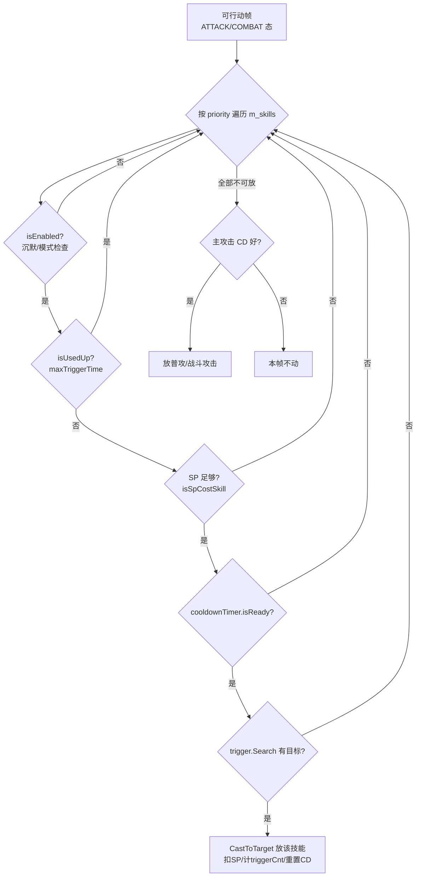

# 敌方技能系统逆向分析（技能释放决策 / 时序 / 打断）

> 数据来源：`Ark_data/dump.cs`（Il2CppDumper，方法体为空壳，结论由签名 / 字段 offset / 枚举 / attribute / 字符串推断）。
> 结论分级：**【确认】**＝有直接代码证据（字段、签名、枚举、注释字符串）；**【推断】**＝由命名与结构关系推得，方法体不可见无法 100% 证实。
> 引用格式：`dump.cs:行号`。本文面向行为模拟器实现，文末附实现清单。

---

## 0. 总体架构

```
数据层(FlatBuffers/ScriptableObject)              运行时(Unity 组件, 挂在敌人 prefab 上)
─────────────────────────────                ─────────────────────────────────────
LevelData.EnemyData                            Enemy : Unit                        (FSM: MOVE/ATTACK/COMBAT/STUN/...)
 ├─ skills[]  (ESkillData)        ──实例化──▶  ├─ mainAttack (AbstractBasicAttack) ─┐
 │   ├─ prefabKey  → 技能 prefab               ├─ mainCombat (被阻挡时的攻击)       │ 都走
 │   ├─ priority / cooldown / initCooldown     ├─ m_skills: List<EnemySkill>        │ Ability
 │   ├─ spCost / blackboard                    │   ├─ Ability (RequireComponent)    │ 管线
 ├─ spData    (ESpData → SpData)               │   ├─ TargetTrigger _trigger        │
 └─ talentBlackboard (Blackboard)              │   └─ EnemySkill.Behaviour[]        │
        │                                      ├─ m_allTalents (BasicTalent 组件)  │
        ▼                                      └─ AttackWrapper / CombatWrapper   ─┘
EnemyDatabase.EnemyData (Undefinable 增量覆盖)            │
 + Rune(词条) 预处理 (ESkillCdMul 等)                     ▼
                                          AbilityStandard._DoCast() 协程
                                           → 事件驱动 ActionNode 列表逐个 Execute()
```

关键事实：**敌人的普攻、被阻挡后的"战斗攻击"、主动技能，三者全部是 `Ability` 对象**，走同一条施放管线；`EnemySkill` 只是包在 Ability 外面的"冷却 + 触发器 + 装饰"壳。【确认】（`EnemySkill` 标有 `[RequireComponent(typeof(Ability))]`，dump.cs:385625；`Enemy.AttackWrapper.mainAttack` / `CombatWrapper.mainCombat` 均为 `Ability`，dump.cs:443284, 443369）

---

## 1. 数据层结构

### 1.1 敌人本体数据 `LevelData.EnemyData`（dump.cs:172092）

| 字段 | offset | 说明 |
|---|---|---|
| `name` / `description` / `key` / `alias` | 0x10–0x48 | 标识 |
| `attributes` | 0x28 | 属性（HP/ATK/baseAttackTime/attackSpeed/spRecoveryPerSec 等） |
| `talentBlackboard` | 0x68 | **天赋参数黑板**（敌人天赋没有独立结构体列表，就是一个 Blackboard） |
| `skills` | 0x70 | `ESkillData[]`，技能列表 |
| `spData` | 0x78 | `ESpData`，技力配置 |
| `m_runtimeData` | 0x80 | `RuntimeData`：dynamicAbilities（动态注入的 Ability）、skinData（dump.cs:172078） |

### 1.2 单个技能 `LevelData.EnemyData.ESkillData`（dump.cs:172044）【确认】

| 字段 | offset | 类型 | 含义 |
|---|---|---|---|
| `prefabKey` | 0x10 | string | **技能 prefab 名**——决定这个技能"是什么"（预制体上挂着具体的 Ability 子类、TargetTrigger、Behaviour 组件，效果逻辑全在 prefab 里） |
| `priority` | 0x18 | int | 优先级（见 §3 选技排序） |
| `cooldown` | 0x1C | float | 冷却（秒） |
| `initCooldown` | 0x20 | float | 首次冷却（出场后的初始 CD） |
| `spCost` | 0x24 | int | 技力消耗；>0 即为"攻回/受回/自回"型技能（见 §4.3） |
| `blackboard` | 0x28 | Blackboard | 技能参数（键值对，prefab 上的组件按 key 读取，如 `atk_scale`、`cooldown_0..N`） |

注意：**数据层没有"trigger 条件"字段**。触发条件由 prefab 上序列化的 `TargetTrigger _trigger` 组件及其参数决定，黑白板只提供数值。也就是说"血量阈值触发"这类逻辑是 prefab 组件行为（Behaviour/Trigger 读取 blackboard 里的阈值 key），不是统一数据结构。【确认：ESkillData 全字段如上；推断：阈值类触发走 blackboard key】

### 1.3 技力数据 `ESpData`（dump.cs:172062）与 `SpData`（dump.cs:188231）

```csharp
class ESpData { SpType spType; int maxSp; int initSp; float increment; }
```

`SpType`（dump.cs:1442353）【确认】：`NONE=0`、`INCREASE_WITH_TIME=1`（自回）、`INCREASE_WHEN_ATTACK=2`（攻回）、`INCREASE_WHEN_TAKEN_DAMAGE=4`（受回）、`ATTACK_OR_DAMAGE=6`、`ALL=7`。
`SpData.CreateFrom(ESpData, Blackboard)`（dump.cs:188279）把敌人级 spData 转成运行时 `SpData`；`attributes.spRecoveryPerSec`（dump.cs:168939）提供自回速率。敌人技力由 `Entity.SpController` 管理（dump.cs:385950：`m_spRecoverTimer`、`OnTakeDamage`、`OnOutputAttackOrHeal` —— 与干员同一套）。

### 1.4 增量覆盖：EnemyDatabase 与词条（Rune）

- `EnemyDatabase.EnemyData`（dump.cs:168870）所有字段都是 `Undefinable<T>`，可对等级数据做增量覆盖；`skills` 经 `_ApplySkillData` 按 prefabKey 匹配增删改（dump.cs:169064, 169008–169022）。【确认】
- 关卡词条（危机合约等）通过 `BasicEnemySkillRune.DoPreprocessEnemySkill(ESkillData, Enemy)` 在战前改写技能数据（dump.cs:494415–494431）。已确认的词条 key（stringliteral.json）：
  `enemy_skill_cd_mul`（CD 乘）、`enemy_skill_init_cd_add` / `enemy_skill_init_cd_mul`（初始 CD 加/乘）、`enemy_skill_sp_cost_add`、`enemy_skill_sp_max_init_add`、`enemy_skill_radius_mul`（范围乘）、`enemy_skill_blackb_add` / `enemy_skill_blackb_mul` / `enemy_skill_blackboard_assign`（blackboard 改写）、`enemy_skill_attributedata_assign`。
  对应 Rune 类：`ESkillCdMul`(494722)、`ESkillInitCdMul`(494800)、`ESkillInitCdAdd`(494826)、`ESkillSpCostAdd`(494748)、`ESkillSpMaxInitAdd`(494774)、`ESkillRangeMul`(494696)、`ESkillBlackboardMul/Add`(494842/494868)。【确认】

> **模拟器注意**：解析关卡数据时，敌人最终技能参数 = 基础 EnemyData ← EnemyDatabase 增量 ← Rune 预处理，三层都要叠。

---

## 2. 运行时组件

### 2.1 `EnemySkill`（dump.cs:385626，`[RequireComponent(typeof(Ability))]`）

序列化字段（prefab 上配置）【确认】：

| 字段 | offset | 含义 |
|---|---|---|
| `_familyMask` | 0x18 | 所属 Ability 族掩码（`FamilyGroupMask`：ATTACK=1/COMBAT=2/SKILL=4/TALENT=8/GENERAL=16，dump.cs:367431） |
| `_trigger` | 0x20 | `TargetTrigger`，目标触发器（§2.3） |
| `_checkParentActive` | 0x28 | 父模式（UnitMode）激活才可用（多形态敌人的形态限定技能） |
| `_maxTriggerTime` | 0x2C | 最大触发次数，配合 `m_triggerCnt`(0x40) 与 `isUsedUp` 实现限次技能（如"只放一次"的冲锋） |
| `_resetMainAbilityCdWhenCastEnd` | 0x30 | **技能放完后重置主攻击 CD**（防止技能后立刻接一刀普攻） |
| `_resetCdWaitFirstPeriod` | 0x31 | 重置 CD 时是否先等满一个周期 |
| `_overwriteInitCooldown` | 0x34 | 覆盖数据层 initCooldown |
| `_ignoreSilence` | 0x38 | 无视沉默 |
| `_immuneStunWhenAffecting` | 0x39 | **技能生效期间免疫眩晕**（EnemySkill 自身实现 `IAttributesModifier`，dump.cs:385626，放技能时给自己加免疫） |
| `_castLikeAttack` | 0x3B | **按普攻方式施放**（占用攻击动作/走攻击流程，见 §4.2） |

运行时字段：`m_cooldownTimer : PeriodicTimer`(0x48)、`m_mainAbility`(0x58)、`m_behaviours[]`(0x68)、`ability`(0x70)、`data`/`owner`(0x80/0x88)。

关键属性/方法【确认为签名，语义为推断】：

- `isEnabled` —— `SetEnabledInternal`；结合 `ownerSkillActivatable`（385735，推断：检查 owner 是否处于可放技能状态——未被沉默/未处于禁用技能的异常中）与 `_ignoreSilence`。
- `isUsedUp` —— 触发次数耗尽。
- `isSpCostSkill` —— `m_spCost > 0`。
- `Tick(FP deltaTime)`(385883) —— 每帧驱动 `m_cooldownTimer` 与各 Behaviour 的 `OnTick`。
- `CheckTrigger(bool allowNoTrigger, bool forceRefresh)`(385874, virtual) —— 查询 `_trigger` 是否找到目标。
- `CheckAvailable()`(385876, virtual) —— 综合可用性（推断：enabled + 未用完 + CD 好 + 未被沉默）。
- `CastToTarget(Entity target, Ability mainAbility, FinishCallbackDelegate finishCb, bool firstAttack)`(385862) —— 真正施放：调内部 ability 的 `CastToTarget`，并把 owner 的主攻击 ability 传入（供 `_resetMainAbilityCdWhenCastEnd`、`castLikeAttack` 联动）。
- `ResetSkillCooldownIfNeeded()`(385864, virtual) —— 施放结束后重置 CD。
- `OnCastSucceed()` / `_OnCastStart()` / `_OnCastFinish(ability, reason, firstAttack)`(385889/385901/385904) —— 施放生命周期回调，内部转发给 `m_behaviours` 的 `OnCastStart/OnCastFinish`。

**变体 `EnemySkillWithCooldownVariable`**（dump.cs:385918）：`m_cooldownSequenceList : List<float>` + `m_currentIndex`，`_CollectCooldownList()` 从 blackboard 收集 `cooldown_0, cooldown_1, ...`（stringliteral.json 存在 `"cooldown_"` 前缀字符串），**每次施放取序列里下一个 CD**——用于"CD 逐次变化"的技能（如越来越强/弱的循环技能）。【确认字段+字符串佐证，序列语义为推断】

### 2.2 `EnemySkill.Behaviour`（dump.cs:385555）

挂在技能 prefab 上的装饰组件，虚函数钩子：`Init / AssignData(Blackboard) / OnAttach / OnDetach / OnTick(FP) / OnCastStart / OnCastFinish(FinishReason)`。基类能拿到 `skill / owner / data / ability`。【确认】
两个具体实例：

- `ReadyEnemySkillEffect`（385470）：CD 转好时挂"就绪特效"（`_stopBeforeCast`），即BOSS技能就绪时身上的提示光圈。
- `RecoverSpForEnemySkill`（385530）：`OnCastFinish` 时 `_RecoverSp(delta)`，`_recoverSpIfNoTarget` 控制无目标时是否也回 SP——技能放完回技力的钩子。

### 2.3 `TargetTrigger`（dump.cs:437376，抽象）

技能的"扳机"。核心接口：`target`（当前目标）、`isReadyToTrig`、`Search(bool force)`、`CheckTargetIn(ILocatable)`、`Reset(owner, ability)`。具体子类如 `TileTrigger`（437436：搜地面格上的目标，`SEARCH_TARGET_TICK=5` 每 5 帧搜一次，`m_findTargetTicker`）、`TileTriggerWithCertainCondition`（437488：附加异常状态过滤）等数十种。【确认接口；子类各自实现"有目标在范围/满足条件"】

> **模拟器简化**：绝大多数敌人技能的 trigger 语义 = "攻击范围（或技能 rangeRadius）内存在可选目标"。`EnemySkill._GetRangeRadius(data, owner)`（385898）静态算技能范围半径。

### 2.4 Ability 管线（核心）

`Ability`（dump.cs:367470，抽象）关键成员：

- `m_cooldownTimer : PeriodicTimer`(0x68)；`m_isCasting`(0x58)、`m_castStartFrameCnt`(0x5C)、`isCasting/isAffecting/isReady/isPredelay`。
- `m_passiveBuffUids`(0x70) —— attach 即挂的被动 buff。
- `InterruptIfNot()`(367827)、`DoFinish(FinishReason, bool resetCd)`(367830)、`UpdateCooldownWhenFinish(FinishReason, bool resetCd)`(367851)、`ResetCooldown(bool waitFirstPeriod)`(367833)、`UpdateCooldown(FP newPeriod, bool waitFirstPeriod, bool keepPassedTime)`(367839)。
- 回调：`onCastStart : Action`(0x18)、`onCastFinish : FinishCallbackDelegate(ability, reason, resetCd)`(0x20，签名见 dump.cs:367388)。

`FinishReason`（dump.cs:367458）【确认】：`NORMAL_EXIT=0`、`INTERRUPTED=1`、`OWNER_DEAD=2`、`TARGET_DEAD=3`、`PALSY=4`。

`Ability.Category`（367448）：`PASSIVE=2` / `ACTIVE=4`。`Ability.FamilyGroup`（367418）：ATTACK/COMBAT/SKILL/TALENT/GENERAL——普攻与技能同族区分靠这个。

### 2.5 Enemy 侧的调度：AttackWrapper / CombatWrapper

`Enemy` 持有（dump.cs:443805–443821）：

- `m_allSkills : EnemySkill[]`(0x448) —— 全部技能组件；
- `m_skills : List<EnemySkill>`(0x4D0) —— 参与轮询的技能列表，`_AssignSkill` 里用 `Comparison<EnemySkill>` 排序（443686 的 `<_AssignSkill>b__476_0`，**按 priority 排序**【推断：比较器存在即排序，方向按 priority 字段】）；
- `m_attackAbilityCasted`(0x4E8) / `m_combatAbilityCasted`(0x4F0) —— 当前/最近一次施放的普攻、战斗 Ability；
- `attackWrapper`(0x550) / `combatWrapper`(0x558)。

`Enemy.AttackWrapper`（443259）——非阻挡状态（远程/行进攻击）：
`mainAttack` + `mainTrigger` + `skills`；方法 `SearchTarget()`、`Cast(out ability, finishCb, firstAttack)`、`_OnCastFinish(ability, reason, resetCd)`、`AssignAbility(ability, target, skill)`、`TryGetFirstAttachedSkill(skillName)`。

`Enemy.CombatWrapper`（443333）——**被阻挡后的近战状态**：
`mainCombat`、`PickCombatAbility()`、`_PickAbility(out ability, out skill)`、`_EarlyPickAbility()`、`StartCombat(firstAttack)`、`NextCombatOrExit(firstAttack)`、`CastWithAssignedSkill`、`m_isCombatInterrupted`(0x29) + `Enemy.SetEnemyCombatWrapperInterrupted()`(444271)。

`Enemy` 上与技能直接相关的方法（签名【确认】，语义见 §3–§6）：

- `TriggerEnemySkill(Ability ability, Entity target, EnemySkill skill, bool assignCombatAbility = true)`（444704）——把指定技能立刻触发（供 ActionNode/脚本调用）。
- `CheckEnemySkillAffecting()`（444707）——是否有技能正在生效中。
- `TryFindFirstEnabledEnemySkill(string skillKey, out EnemySkill skillFound, bool checkActivate)`（445001）。
- `TryGetFirstAttachedSkill(string skillName)`（444923）。
- `TryUpdateEnemySkillSelector(string skillKey, bool checkActivate, string blackboardKey, FP value)`（445043）——运行时改技能选择器参数（如动态改 max_target）。
- `InterruptLastAbilityIfNot(bool resetCooldown, Ability ability)`（444680）——**打断上一次施放的 Ability（除非它就是传入的 ability），可选是否重置 CD**。
- `GetCurrentAttackOrCombatAbility()`（444692）→ 返回当前应使用的 `AbstractBasicAttack`。
- `_AssignSkill(IList<ESkillData>)`（444989）/ `_AssignTalent(Blackboard)`（444992）——Spawn 时挂载。
- `OnBeforeAttack(Ability, bool isCombat)` / `OnAfterAttack(Ability, bool, FinishReason)`（445025/445028）。
- `CanDoAbilitySpellOn(Ability, out FinishReason)`（445034，override Unit 的虚方法 388174）——**施放前检查：当前状态能否让技能效果打出来，不能则给出打断原因**。
- `OnTriggerPalsy()`（445031，override 388138）——麻痹触发钩子。

### 2.6 敌人 FSM（`Enemy.States.State`，dump.cs:441897）【确认】

`DEFAULT=0, MOVE=1, ATTACK=2, COMBAT=3, STUN=4, DEAD=5, BORN=6, REACH_EXIT=7, REBORN=8, UNBALANCE=9, FALLDOWN=10, DISAPPEAR=11, BLINK=12, FROZEN=13, LEVITATE=14, DIALOG=15, PALSY=16`

对应状态类：`MoveState`(442119)、`AttackState`(442158，含 `_AttackFinishCallback(ability, reason, resetCd)`)、`CombatState`(442364)、`StunState`(442388)、`PalsyState`(442412，颤抖表现)、`FreezeState`(442451)、`LevitateState`(442516) 等。敌人施放攻击/技能时处于 ATTACK 或 COMBAT 态，施放完成回调里切回。

---

## 3. 选技决策流程

### 3.1 决策规则（综合证据后的推断流程）

证据：`m_skills` 按 priority 排序（443686 比较器）；`TryFindFirstEnabledEnemySkill(skillKey, out, checkActivate)`（445001）；`AttackWrapper.Cast`/`CombatWrapper._PickAbility` 都返回 `(Ability, EnemySkill)` 对；`EnemySkill.CheckAvailable()` + `CheckTrigger(allowNoTrigger)` 分离；`Nodes.TriggerEnemySkill` 的 TooltipsBox 明确说"trigger logic will be different between combat state and non-combat state"（dump.cs:600939）【确认这句注释】。

**伪代码（行为模拟器可直接实现）：【推断】**

```python
def pick_action(enemy):
    # 每个可行动帧（处于 ATTACK 或 COMBAT 态、当前无 ability 在 cast/affecting）调用
    wrapper = enemy.combatWrapper if enemy.is_blocked else enemy.attackWrapper

    # 1. 按 priority 顺序扫技能列表（m_skills 已在 _AssignSkill 时排序）
    for skill in enemy.m_skills:            # priority 降序（推断方向）
        if not skill.isEnabled:  continue   # 含沉默检查（_ignoreSilence 可豁免）
        if skill.isUsedUp:       continue   # _maxTriggerTime 限次
        if skill.isSpCostSkill and enemy.sp < skill.m_spCost: continue
        if not skill.cooldownTimer.isReady: continue
        if not skill.CheckTrigger(allowNoTrigger=False): continue  # 有目标？
        # → 找到：放技能
        return CastSkill(skill, wrapper)

    # 2. 没有可用技能 → 主攻击（普攻/战斗攻击）自己的 CD 好就放
    main = wrapper.mainCombat if enemy.is_blocked else wrapper.mainAttack
    if main.isReady:                        # 攻击间隔到（baseAttackTime/attackSpeed）
        return CastMainAttack(main, wrapper)
    return None
```

**流程图：**



### 3.2 关于"血量阈值/被阻挡触发"类条件

数据层没有统一 trigger 字段（§1.2）。这类条件由两种机制实现：

1. **TargetTrigger 子类**（如带异常过滤的 `TileTriggerWithCertainCondition`）在 `Search()` 里判定；【确认机制存在】
2. **EnemySkill.Behaviour 子类**在 `OnTick` 里自行检测（如血量比例），满足后调用技能施放或改写 blackboard；【推断，Behaviour 有 OnTick+data 访问权】
3. **脚本强推**：关卡/Boss 阶段逻辑用 `Nodes.TriggerEnemySkill`（600935）直接触发，附带 `_checkSkillActive/_checkSkillReady/_interruptCurAbility/_forceFindTargetBySkillSelector/_clearPalsyingBuffBeforeTrigger/_tryCastDirectlyWhenNoTarget` 等开关；配套探测节点 `Nodes.CheckEnemySkillSelectorHasTargets`（600671）、`Nodes.CheckEnemySkillAffecting`（590513）、`Nodes.ModifyEnemySkillMaxTarget`（600817）。【确认】

---

## 4. 释放时机规则

### 4.1 冷却

- CD 由 `PeriodicTimer`（dump.cs:112094）驱动：`Update(deltaTime)` 递减 `m_remainingTime`，`isReady` 到期为真；`Reset(waitFirstPeriod)` / `ResetButKeepPastTime` / `ResetButKeepProgress` 提供多种重置方式。
- 首次 CD 用 `initCooldown`（可被 prefab `_overwriteInitCooldown` 覆盖，可被词条 `enemy_skill_init_cd_*` 改写）。
- **"CD 转好就放吗？"** —— 还需同时满足：trigger 有目标（除非 ability `allowNoTarget`，367710）、SP 够、未被沉默、当前处于可行动状态。BOSS 类技能常以 initCooldown 控制"出场 X 秒后第一发"。【推断，综合 §3.1】
- **眩晕/冻结期间 CD 是否继续走？** ——【推断】**继续走**。依据：`EnemySkill.Tick` 由 Enemy 的帧更新驱动，StunState/FreezeState 自身也有 `OnTick`（442402/442503），没有发现暂停技能 CD 的机制；但**不能施放**——STUN/FROZEN/PALSY/LEVITATE 态不是 ATTACK/COMBAT 态，且正在施放的 ability 会被打断（§6）。这与玩家侧观测一致（晕住敌人不拖慢其技能计时，只是放不出来）。
- **沉默**：禁用技能施放（`CheckAvailable`/`ownerSkillActivatable`），`_ignoreSilence=true` 的技能豁免；沉默不锁普攻。敌人数据层有 `silenceImmune`（168961）。【机制确认；细节推断】

### 4.2 施放与移动/普攻的关系

- **技能期间能否移动**：攻击/技能施放发生在 ATTACK/COMBAT 态，此时敌人不行进（MOVE 态才移动）。【推断，由 FSM 结构】例外：瞬发型/光环型技能（`allowNoTarget`、`CastDirectly`、无施法动画的 prefab）可以不切状态直接生效——`_castLikeAttack=false` 的技能倾向于这类"不打断行进"的放法。【推断】
- `_castLikeAttack=true`：技能按一次攻击来处理——占用攻击动作、吃攻速缩放、与普攻互斥，放完视 `_resetMainAbilityCdWhenCastEnd` 决定是否重置普攻 CD。【推断，命名与联动字段】
- 技能与普攻**互斥**：同一时刻只有一个 ability 在 cast；新施放前可经 `InterruptLastAbilityIfNot` 打断上一个。

### 4.3 SP 型技能（攻回/受回）

`spCost>0` → `isSpCostSkill`；SP 由 `Entity.SpController` 按 `SpType` 累积（自回 timer / 攻击时 `OnOutputAttackOrHeal` / 受击时 `OnTakeDamage`，385950–386046）；施放时 `TryReduceSp(spCost)`（385895）扣除；`RecoverSpForEnemySkill` Behaviour 可在施放结束时回补（如"没打到人也返 SP"）。【确认字段与钩子存在，流程推断】

---

## 5. 施放时序（帧级）

### 5.1 一次施放的完整管线

`AbilityStandard`（dump.cs:368229）是所有带演出 Ability 的基类；`_DoCast()` 是协程（368507，IteratorStateMachine），生命周期由 `AbilityStandard.Event`（367997）驱动【确认枚举】：

```
ON_ATTACHED=0  ON_DETACHED=1  ON_CAST_START=2  ON_CAST_END=3
ON_SPELL_ON=4  ON_SPELL_END=5  ON_ATTACK_FINISH=6
ON_ATTACK_CHECK_POINT=7  ON_OVERLOAD=8
```

**时序（推断组装，锚点全为确认签名）：**

```
CastToTarget(target, finishCb, firstAttack)              [AbilityStandard.CastToTarget 368400]
  │  _CheckGameObjectActiveBeforeCast / DealWithFaceDirection(_faceToTarget 等)
  │  owner.CanDoAbilitySpellOn(ability, out reason)      [445034] 失败 → 直接 DoFinish(reason)
  ▼
OnCastStart → 广播 ON_CAST_START                          [368472]
  │  StartCastingInternal: m_isCasting=true, 记 m_castStartFrameCnt（逻辑帧号）
  ▼
前摇 OnWaitForPreDelay() 协程                             [368456 abstract]
  │  - AbstractAnimatedAbility: _preDelay 秒（532417）
  │    或 "waitForAttackEvent" 模式：等动画事件（EasyToStartAbility.WaitForNextEvent(ev, maxWaitingTime) 532823）
  │  - 前摇时长随动画缩放：m_animScale/spineAnimSpeed，受 attackSpeed 与减速影响
  │    （ApplyAttackTime/OnAttackTimeChanged/OnSlowDownChanged，532571–532577）
  │  - 期间 isPredelay=true；IsOnFirstCastFrame() 可查"施放首帧"
  ▼
效果触发点 OnSpellStart() → 广播 ON_SPELL_ON              [368466]
  │  DoCastOnTargets → OnCastOnTarget(target, actions, buffs, attachments)
  │  → **逐个 Execute() ActionNode**（伤害 Nodes.ApplyDamage / buff / 特效）
  │  - 近战类在动画 ON_ATTACK_CHECK_POINT（动画事件帧）触发伤害，而非第 0 帧
  │  - CheckAnotherSpell(spellCnt) → 多段攻击循环 OnSpellStart（spellCnt++）
  ▼
后摇 OnWaitForPostDelay() 协程                            [368459 abstract]
  │  ON_SPELL_END / ON_ATTACK_FINISH（全部段落打完）
  ▼
OnCastEnd(reason) → DoFinish → UpdateCooldownWhenFinish(reason, resetCd)
  │  finishCb(ability, reason, resetCd) 通知 Enemy/Wrapper：
  │  AttackState._AttackFinishCallback → 切回 MOVE/COMBAT；
  │  EnemySkill._OnCastFinish → m_triggerCnt++、ResetSkillCooldownIfNeeded、
  │  （可选）重置主攻击 CD、TryReduceSp、Behaviour.OnCastFinish
  ▼
CleanupForNextCast()
```

### 5.2 帧率与缩放要点

- 战斗用定点数 `FP` + 逻辑帧（`m_castStartFrameCnt`、`IsOnFirstCastFrame()`，367485/367854）——**模拟器应按固定帧步进，不要用 wall-clock**。
- 前摇/后摇/多段间隔都是**秒数（float）经动画缩放**：`m_animScale` 由攻击间隔反推（`AbstractAnimatedAbility.UpdatePlaybackSpeed`，532619），`MIN_ANIM_SCALE=0.1`、`_maxAnimScale` 封顶（532386/532436）；`affectedBySlowDown` 决定减速 debuff 是否拉长前摇（532442，`AutoDetermineAffectedBySlowDown` 532613）。
- 效果帧（伤害帧）= 动画事件 `ON_ATTACK_CHECK_POINT` 或 `OnSpellStart` 时刻；多段 = `CheckAnotherSpell(spellCnt)` 循环。
- 弹道类技能的伤害在 projectile 命中时执行 `GetProjectileActions(ev, projectile)` 返回的 ActionNode（367869），与施放时刻解耦。

### 5.3 效果执行：ActionNode

`ActionNode`（dump.cs:550903）是效果原子：`Execute(Blackboard blackboard, SourceType sourceType, ref Context.Snapshot snapshot)`，带 `executeCondition` 与 `allowedSource`（ABILITY/BUFF/PROJECTILE 等来源过滤）。技能 prefab 上按事件挂 ActionNode 列表（`GetEventActions(Event)`，368432 抽象）；命中时遍历执行。`ActionNodeArray : List<ActionNode>`（162805）。**模拟器实现技能效果 = 翻译其 prefab 序列化的 ActionNode 列表**（节点类以 `Nodes.*` 命名，数百种，含 Filter/If/分支——`Nodes.FilterByAbilityFinishReason` 586097 可按结束原因分支）。

---

## 6. 打断与恢复规则

### 6.1 打断源与表现

- `Ability.FinishReason`：`INTERRUPTED=1`（通用打断）、`PALSY=4`（麻痹）、`OWNER_DEAD`（宿主死）、`TARGET_DEAD`（目标死）。【确认】
- AbilityStandard 注册了状态钩子：`OnStunnedChanged / OnFrozenChanged / OnLevitateChanged(object arg)`（368490/368493/368496）——**眩晕/冻结/浮空会打断正在施放的 Ability**（跳入对应 FSM 态，当前 cast 以 INTERRUPTED 结束）。【推断：钩子+状态机并存即此意】
- `Ability._interruptAbilityOnDetach`(0x40，367480)：组件卸载时是否打断。【确认字段】
- 麻痹（Palsy）：`Enemy.OnTriggerPalsy()`（445031）+ `FinishReason.PALSY`；Ability 可用 `_ignorePalsyInterrupt`（AbstractAnimatedAbility 532440 → `ignorePalsyInterrupt` 367502）豁免。【确认字段，流程推断】
- 反向保护：`_immuneStunWhenAffecting`（385646）让敌人**技能生效期间免疫眩晕**（施放不可被打断）；Ability 侧也有对称的 `ignorePalsyInterrupt`。
- 脚本打断：`InterruptLastAbilityIfNot(resetCooldown, ability)`（444680）；ActionNode `Nodes.TriggerEnemySkill._interruptCurAbility / _interruptCurAbilityUnlessItIsExpectedAbility`（600950/600952）。

### 6.2 打断后 CD 与重放

- 打断 = 走正常结束路径 `DoFinish(reason, resetCd)` → `UpdateCooldownWhenFinish(reason, resetCd)`（367830/367851），**resetCd 由打断发起方传入**：`InterruptLastAbilityIfNot(bool resetCooldown, ...)` 显式提供【确认参数存在】。被眩晕打断时按何种 resetCd 调用——方法体不可见，**【推断】：异常状态打断等价于"这次没放成"，CD 不重置或保留进度**（`PeriodicTimer.ResetButKeepPastTime/ResetButKeepProgress` 的存在支持"保留进度"语义，112137/112140）；技能结束后恢复正常决策循环，CD 好了（或仍处就绪）会**立刻重新尝试施放**，不存在"打断后额外惩罚 CD"的结构。
- 动画恢复：`AbilityStandard.UpdatePlaybackSpeedTiming.RECOVER_FROM_INTERRUPT = 2`（368042）——**存在"从打断中恢复"的播放速度刷新时机**，说明部分 Ability 设计为打断后可续播而非从头开始（多见于 channeling/持续型）。【确认枚举值；适用范围推断】
- `m_isCombatInterrupted` + `SetEnemyCombatWrapperInterrupted()`（443340/444271）：被阻挡近战（COMBAT 态）被打断的标记，恢复后由 `NextCombatOrExit` 重新 PickAbility 继续战斗循环。【确认字段，语义推断】
- `Nodes.TriggerEnemySkill._clearPalsyingBuffBeforeTrigger`（600958）：脚本触发技能前可先清麻痹 buff——侧面证明麻痹会阻止/打断技能。【确认】

### 6.3 打断规则速查（模拟器实现）

| 场景 | 当前 cast | CD | 恢复后 |
|---|---|---|---|
| 眩晕/冻结/浮空 | INTERRUPTED 结束 | 保留进度（推断） | 回 ATTACK/COMBAT 态重新走 §3 决策，就绪即重放 |
| 麻痹 Palsy | PALSY 结束（除非 ignorePalsyInterrupt） | 同上 | 同上 |
| 目标死亡 | TARGET_DEAD 结束 | 由该 Ability 的 OnCastEnd 处理 | 重新搜目标 |
| 宿主死亡 | OWNER_DEAD | — | — |
| 技能带 immuneStunWhenAffecting | 不可被晕打断 | — | — |

---

## 7. 天赋（被动）系统

- 数据层：敌人天赋 = `EnemyData.talentBlackboard`（一个 Blackboard，168887/172109），**没有类似干员 TalentData 列表的结构**；天赋逻辑全部序列化在敌人 prefab 的 `Talent`/`BasicTalent` 组件上，从 blackboard 按 key 读数值。【确认数据结构；"逻辑在 prefab"为推断】
- 运行时：`BasicTalent : MonoBehaviour`（424245），`Attach(Unit owner)`/`Detach()` 在出生/回收时调用；`m_ability`(0x38)——**天赋内部也可以挂一个 Ability**（Category=PASSIVE，进场 AddPassiveBuffs，367923）；`GatherBuffs` 提供常驻 buff。
- 与主动技能的差异：天赋无 CD/无 trigger/无施放动作，Attach 即生效；`_checkValidBySkillIndex`、`CheckValidModeTalent` 支持"按形态/技能序号启用"。
- 天赋可反向影响技能：`Talent._influenceSkillBlackboard` / `_applyBlackboardBySkill` / `_applyTalentScale`（426299–426309），`GetSkillBlackboardFromRawData(TalentData)`（426422）——天赋数值可写进技能 blackboard（如"技能伤害 +X%"）。【确认字段】
- 词条可改天赋数值：`ETalentBlackboardMul/Add/Max`（494554/494580/494596）。
- 敌人普攻确认走 Ability 体系：`AttackWrapper.mainAttack` 是 `AbstractBasicAttack`（MeleeAttack/RangedAttack/MultiMeleeAttack 等），`m_attackAbilityCasted` 记录最近一次；攻速/攻击间隔由 `attributes.baseAttackTime` + `attackSpeed` 经 `ApplyAttackTime` 缩放动画实现。【确认】

---

## 8. 事件与外部观测点

`BattleEvent`（366811）中技能相关：`ON_ABILITY_CASTED=15`、`ON_SKILL_CASTED=25`、`ON_CHARACTER_ATK_OR_CBT=26`、`ON_SKILL_BEGIN_BEFORE_START=63`、`ON_BEFORE_APPLYING_MODIFIER=12/13/14`（伤害/治疗修饰）。模拟器可在对应时点发同名事件方便对齐日志。

---

## 9. 行为模拟器实现清单（落地建议）

1. **数据结构**：`EnemyData{ skills:[{prefabKey,priority,cooldown,initCooldown,spCost,blackboard}], spData, talentBlackboard }`；叠加 EnemyDatabase 增量与 Rune 改写后再实例化。
2. **每帧**：固定步长推进 → 更新所有技能 `cooldownTimer` 与 SP → 若处于可行动态且无 cast 中 ability → 按 §3.1 决策。
3. **施放**：`cast_start → predelay(缩放) → spell_on(执行 ActionNode 列表) → [多段] → postdelay → cast_end(reset CD, 扣SP, triggerCnt++)`。效果帧默认取 predelay 结束点；有动画事件数据的取 CHECK_POINT 帧。
4. **打断**：进入 STUN/FROZEN/LEVITATE/PALSY 时，当前 cast 以对应 reason 结束（保留 CD 进度），CD 计时不停；恢复后下一可行动帧重新决策。
5. **豁免**：`silenceImmune/_ignoreSilence`（沉默）、`_immuneStunWhenAffecting/ignorePalsyInterrupt`（打断免疫）、`stunImmune` 等数据层免疫位（168959–168979）。

## 10. 主要不确定点

1. `m_skills` 排序方向（priority 升/降序）——比较器存在【确认】，方向【推断】为降序（高优先级先找）。
2. 眩晕打断后 CD 精确处理（重置 vs 保留进度）——两条路径的工具方法都在，具体选择【推断】为保留进度；可用现网内存工具（tools/deploy_tracker 的 BattleLogger 通道或 ak_live_rng 的 MemCore）实测 `m_cooldownTimer.m_remainingTime` 验证。
3. 非 castLikeAttack 技能是否完全不切 FSM 态（边走边放）——【推断】。
4. Behaviour/Trigger 具体子类的阈值触发语义需逐个 prefab 翻译（数据在 `data/pkgrps/btl_pfb_enemy_*` 的 MonoBehaviour 序列化里，`unpack_work/mouse_level_20260803/MonoBehaviour_#.dat` 即此类 dump）。
